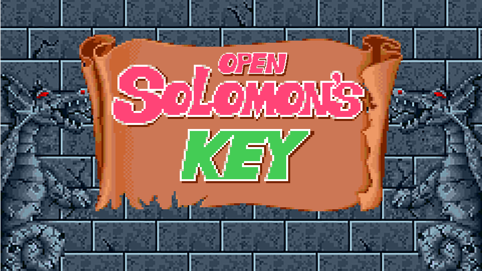

# OpenSolomonsKey
Linux and Windows Solomon's Key (1986) port.

### About (Wikipedia):
Solomon's Key (ソロモンの鍵 Soromon no Kagi) is a puzzle game developed by Tecmo in 1986 for arcade release on custom hardware based on the Z80 chipset. It is better known as a 1987 port to the Commodore 64 and the Nintendo Entertainment System, although it also appeared on many other game systems of the time, like the Sega Master System in 1988 and the Famicom Disk System, released in Japan on January 25, 1991.

This is a port of the arcade version of the game, currently on linux and
Windows. It's going to include a level file format so you can
make your own levels.

If you are on Windows you can check out a completed port on
[GMS2 by immortalx](https://immortalx74.itch.io/solomonskeyremake).

### Building
Building just requires you to run the corresponding build script for the platform, and have some basic stuff installed, for win32 you'll need glm in an incl folder in the root of the project,
and for linux you need the Xlib and alsa development libraries installed.

### Resolution Independence
    Resolution independence can be achieved in two ways, how I see it. You can (1) Render to a texture of a specific resolution and then upscale or
    downscale according to the window's dimensions, or (2) use a basis for calculating a specific metric (like a pixel's size).

Adding to that, in order to not have our calculations messed up because of weird scaling issues, we'll do all calculations with a tile size of 64, and scale everything back accordingly. So if the current resolution dependent tile size would be, say 55, then we would scale everything by 55 / 64 = 0.859375.

### Configuration
I've chosen to do cofiguration at compile time, meaning all the locations
(relative) of the resources that cannot be embedded easily in the executable
are predefined, as well as all the animations. To change an animation, you'd
have to compile the whole thing again, but it shouldn't take long.

I really don't want to have to deal with where config files should be put in
either of the two currently supported platforms, so I've written this macro based method of doing configuration in input.h and resources.cpp.
